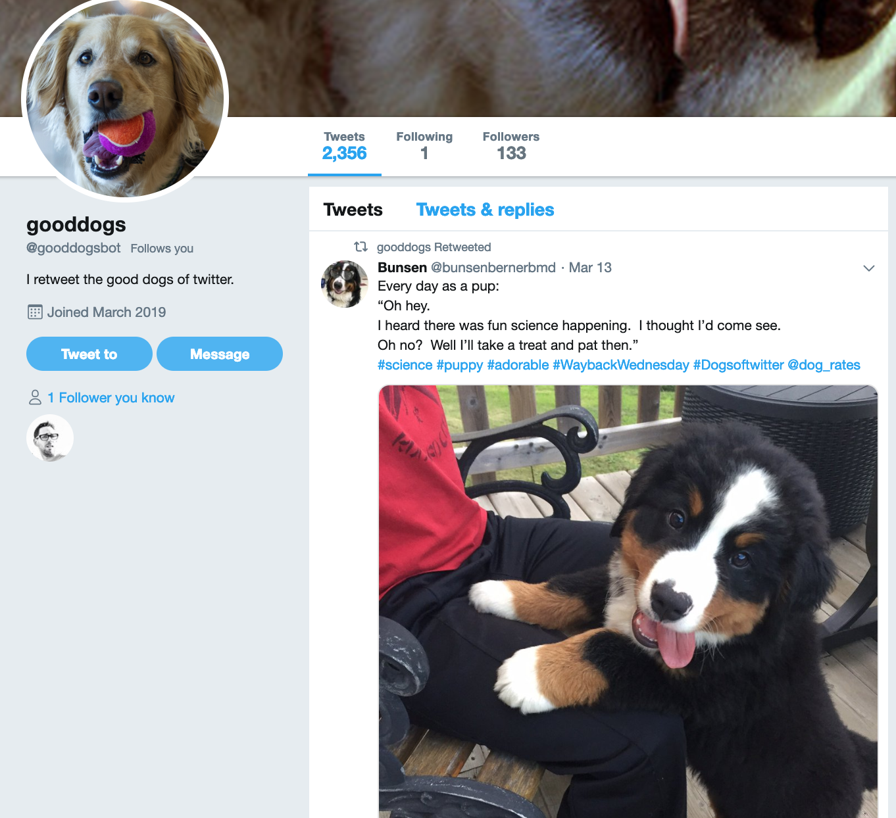

#Good Dogs Twitter Bot
Built in Python with the Tweepy library and the Twitter API. 
It retweets pictures and videos of dogs based on the following:

- [x] Uses the hashtag #gooddog, #cutedog, or #dogsoftwitter  
- [x] Is original (not a retweet)  
- [x] Includes a picture or video  
- [x] Has been liked at least 200 times  
- [x] Author's name does not contain certain keywords usually associated with businesses ('design', 'company', etc.)

Live on Twitter at [@goodDogsBot](https://twitter.com/gooddogsbot).  

